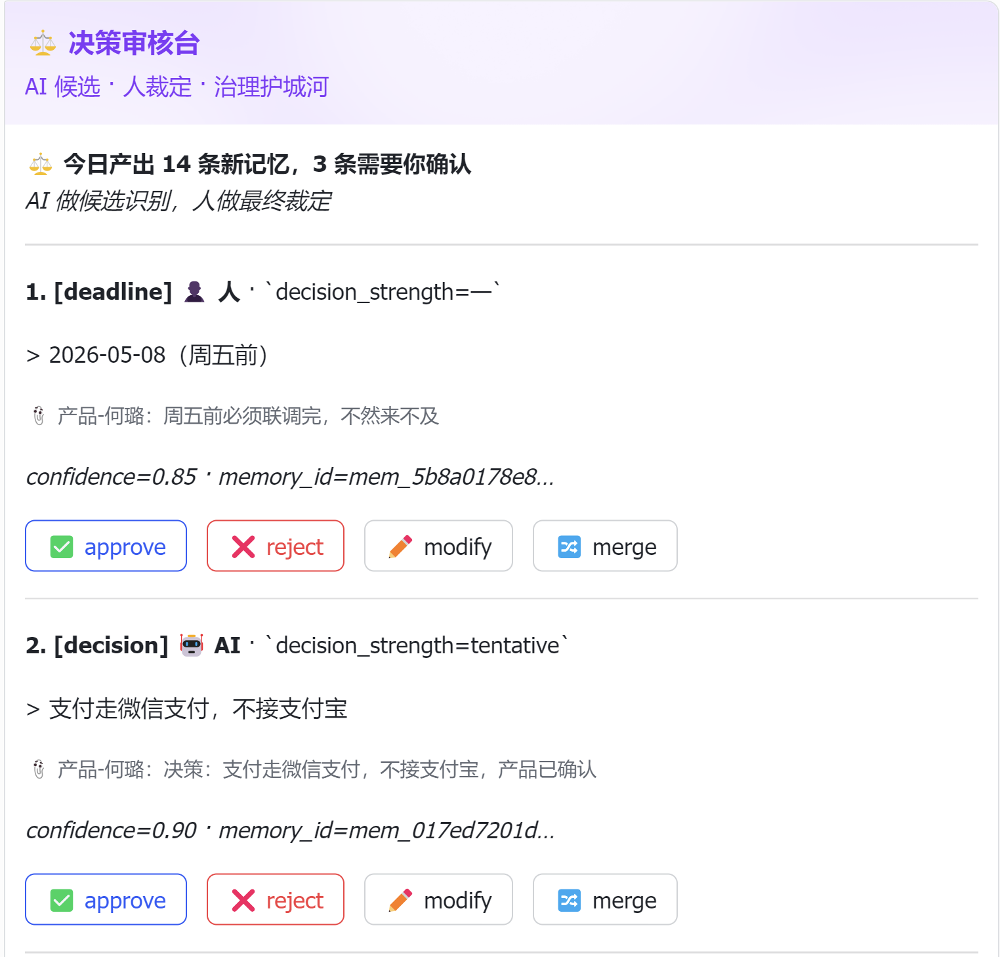
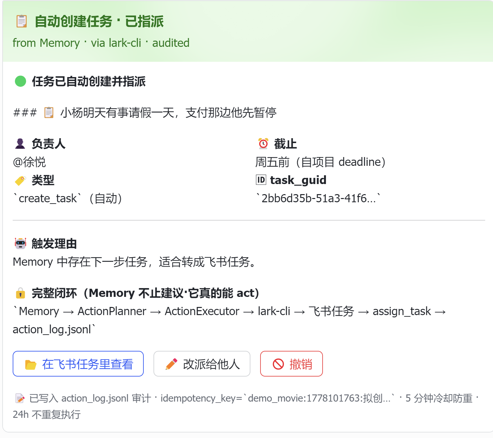

# OpenClaw Memory Engine

> **The OS for hybrid human-AI teams.** 让 5 个人 + N 个 AI Agent 像 6 个真同事一样协作。

OpenClaw Memory Engine 从飞书群消息、文档、任务、日历中**持续提取结构化协作状态**（目标 / 负责人 / 决策 / 阻塞 / 截止日 / 下一步 / 暂缓 / 成员状态），绑定原始消息证据，并把它们以**正确的形式**主动送到正确的**人或 AI Agent** 面前——0 秒重建工作上下文，0 早会同步进度，0 交接会议接手项目。

它的真正使命不是"记住聊天记录"——是消除企业协作中的**状态转移成本**（context rebuild），让团队的有效工作时间从 50% 提到 80%+。

## 30 秒看懂

```
人类用户            飞书群聊 / 文档 / 任务
     ↓                       ↓
     └──────────→ Memory Engine ←──────────┘
                       ↓
        ┌──────────────┼──────────────┐
        ↓              ↓              ↓
    个人简报        全组编排       AI Agent
   (Morning)    (Orchestrator)    (Risk Analyzer)
        ↓              ↓              ↓
    回到飞书 · 卡片 · 证据链 · actor_type 审计
```

- **结构化抽取**：飞书群里的口语 → 8 类协作状态 + 6 类二阶 Pattern
- **Hybrid 调度**：规则优先 → 模糊语义触发 LLM → 纯问句跳过（成本降 73%）
- **AI 同事**：AI Agent 通过 CLI 读 Memory + Pattern → 给风险分析 + 行动建议（12 秒端到端）
- **可审计**：每条记忆带 sender_name + 飞书消息 URL + actor_type=ai_agent 标识
- **完整闭环**：从飞书来 → 提取 → 推理 → 通过卡片回到飞书 → 写回 Memory

---

## 🎬 Live Demo: 一天里的 6 个场景

```bash
python scripts/demo_movie.py --all --feishu     # 一键发完 6 张飞书卡片
```

| # | 时刻 | 卡片 | 系统能力 |
|---|------|------|----------|
| 🌅 | 08:32 通勤路上 | **个人晨报** — "你不在的 2 天里发生了 5 件事" | `morning_briefing` |
| 🎯 | 09:00 项目大群 | **全组任务编排** — "拉开堵塞口，多米诺式解锁 3 个下游" | `orchestrator` |
| 🚨 | 11:08 群里求救 | **AI 风险分析** — "周五能上线吗？" → AI 12 秒给出 P0/P1 行动建议 | `demo_agent_loop` |
| 📍 | 12:50 系统播报 | **阻塞热点预警** — "本周阻塞集中在设计稿（67%），是节奏问题" | `blocker_hotspot` |
| 📊 | 18:00 站会自动 | **站会摘要** — Yesterday/Today/Blockers 三段式 | `standup_summary` |
| ⚖️ | 18:30 CTO 私聊 | **决策审核台** — AI 候选 + 冲突检测 + 人裁定 | `review_desk` |
| 📋 | 19:50 突发离场 | **8 维度交接摘要** — 接手人 0 秒上岗 | `handoff` |

每张卡片均**真实通过 lark-cli 投递到飞书群**，每条信息附 📎 sender + 原文 + 飞书可点击链接。






---

## Memory Engine ≠ Chat History

ChatGPT 的聊天记录是线性文本回放。Memory Engine 从飞书群消息中提取**结构化协作状态**——谁负责什么、做了什么决策、被什么阻塞了——并绑定原始消息证据锚点。每条记忆都有版本号、置信度、证据来源（含发送者和飞书链接），支持时间点查询（As-of query）和版本追溯。

## Memory Engine ≠ 普通 RAG

普通 RAG 将文本切片后做向量相似度搜索。Memory Engine 不使用向量库，通过结构化提取 + Schema 校验 + 四层去重 + Hybrid（规则优先/LLM 补充）的组合策略，把飞书协作信息转化为**可审计的协作状态机**。

## 与同类项目的差异

| 维度 | mem0 / Letta / graphiti | OpenClaw Memory Engine |
|------|------------------------|------------------------|
| 存储 | 向量库 + 嵌入模型 | 结构化 JSON/JSONL + 四层去重 |
| 检索 | 向量相似度搜索 | identity_key + as_of 时间点 + 关键词 + 多条件组合 + 倒排索引 |
| 飞书深度 | 通用记忆，需适配 | 原生 LarkCliAdapter + @提及解析 + 安全策略 + bot 发消息/置顶 |
| 提取策略 | LLM 或规则单一模式 | Hybrid 规则优先 + LLM 按需补充（DeepSeek V4 Pro） |
| 目标 | 个人助手的长期记忆 | 团队协作的"中断续办"状态 |
| 证据锚点 | 无或弱 | 每条记忆绑定 sender_name + message URL + excerpt + 原文验证 |
| 安全 | 无 | 只读/写入命令分离，dry-run 不信任，写入需 allow_write=True |
| 审计 | 无内置 | version + supersedes + history + as_of + find_items_by_message_id |
| 评测 | 无标准化 | 150 条 Golden Set + 三模式对比 + 证据链追溯 |

## 核心能力

| 能力 | 说明 | 引入版本 |
|------|------|----------|
| 群聊消息提取 | 从飞书群消息提取目标/负责人/决策/阻塞/下一步 | V1 |
| 关键词规则提取 | RuleBasedExtractor，12 种场景 + 5 种 owner 格式 | V1 |
| 可信 LLM 提取链路 | LLM → Schema 校验 → 规则兜底 → excerpt 原文验证 | V1.12 |
| 四层去重 | Identity Key → Content Hash → Semantic → 跨 key 决策/截止覆盖 | V1.11 |
| Prompt Grounding | 代词/时间/空间解析，sender.name 真实姓名绑定 | V1.12 |
| Debounce 持久化 | `_last_process_time` 写入文件，重启不丢失 | V1.11 |
| 否定极性检测 | "拒绝负责"/"不负责"不被错误合并 | V1.6 |
| 低置信度过滤 | ambiguous + confidence≤0.3 的后处理丢弃 | V1.6 |
| Bi-temporal 查询 | valid_from/valid_to，as_of 时间点查询 | V1.6 |
| 成员状态识别 | 请假/出差/工作偏好提取，value 裁剪 | V1.11 |
| 真实 LLM 集成 | DeepSeek V4 Pro + JSON mode + temperature=0 | V1.11 |
| 文档/任务数据源 | 从飞书文档/任务提取协作状态 | V1.8 |
| 多条件搜索 | project_id + state_type + keyword + owner + message_id + as_of | V1.12 |
| 倒排索引 | 全文 token 索引，O(1) 关键词检索 | V1.12 |
| 项目状态面板 | 群状态 / 个人上下文 / Agent 上下文包（含证据引用） | V1.12 |
| Hybrid 提取 | 规则优先 + LLM 按需补充 + 二次兜底 | V1.11 |
| 分模式评测 | 同一 Golden Set 支持 rule/hybrid/llm 三套期望 | V1.10 |
| 飞书端到端 | sync → extract → state panel → send → pin | V1.11 |
| 证据链追溯 | SourceRef 含 sender+URL，excerpt 原文验证，find_by_message_id | V1.12 |
| 交接摘要 | Markdown 含 sender + 飞书链接 + [unverified] 标记 | V1.12 |
| 日历/会议/审批接入 | sync_calendar/sync_minutes/sync_approvals 三数据源 | V1.13 |
| 闭环执行层 | ActionExecutor: create_task/create_doc/send_message/@mention | V1.14 |
| 触发引擎 | ActionTrigger 3规则: next_step→task, blocker→alert, deadline+blocker→warning | V1.14 |
| 决策分层 | decision_strength: discussion/preference/tentative/confirmed | V1.15 |
| 高风险审核台 | review_status + CLI approve/reject/modify/merge + 管家身份验证 | V1.15 |
| 阻塞生命周期 | blocker_status: open→acknowledged→waiting_external→resolved→obsolete+7天sweep | V1.15 |
| 冲突检测 | 同主题决策差异自动标记冲突，审核台并排展示证据 | V1.15 |
| 多负责人共存 | domain-based key 替代硬编码 current_owner | V1.15 |
| Selector 模式 | 精确信号→规则提取，模糊信号→LLM，纯问题→跳过 | V1.17 |
| WebSocket 事件监听 | lark-cli event +subscribe 封装，心跳/重连/事件路由 | V1.16 |
| @bot 指令响应 | 群内发"状态/风险/待审核/站会/交接"自动回复 | V1.16 |
| 每日早报 + 站会摘要 | 9点自动同步 + yesterday/today/blockers 三段式 | V1.16 |
| 低置信度主动提问 | R4 规则：按人聚合/冷却/门槛/上限/延迟 5 约束 | V1.16 |
| Work Pattern Memory | 6 种模式：handoff_risk/dependency_blocker/blocker_hotspot等 | V1.18 |
| 按类型 P/R/F1 报告 | Golden Set 按 state_type 分解 precision/recall/F1 | V1.15 |
| 稳定性加固 | subprocess超时/原子写入/损坏恢复/孤儿进程清理/17新测试 | V1.18 |

## 项目结构

```
openclaw-memory/
  src/memory/
    schema.py           MemoryItem, SourceRef 数据模型（sender+URL+V1.12）
    store.py            JSON/JSONL 存储 + 四层去重 + as_of + 多条件搜索 + 倒排索引
    extractor.py        RuleBased + LLM + Hybrid 三套提取器 + 隐式 Prompt
    engine.py           MemoryEngine: ingest → extract → upsert + debounce 持久化
    candidate.py        MemoryCandidate 校验 + excerpt 原文验证 + ADD-only 策略
    handoff.py          交接摘要 Markdown 生成（含 sender + URL + unverified 标记）
    action_planner.py   行动计划生成（非执行）
    llm_provider.py     LLMProvider 接口 + FakeLLMProvider + OpenAIProvider (JSON mode)
    project_state.py    项目状态面板（含证据引用 source_refs）
  src/adapters/
    lark_cli_adapter.py 飞书 CLI 封装 + send/reply/pin/unpin + SafetyPolicy 集成
    command_registry.py 命令分类（只读/写入/BLOCKED_DRY_RUN）+ im pins 注册
  src/safety/
    policy.py           安全策略
  tests/                # 327 个测试，全部通过
  scripts/
    demo_run_example.py      一键演示（Fake LLM）
    demo_sync_messages.py    飞书消息同步（分页 + 增量去重）
    demo_handoff.py          交接摘要生成
    demo_action_plan.py      行动计划生成
    demo_e2e_pipeline.py     端到端：sync→extract→send→pin
    demo_evidence_trace.py   证据链追溯（tree/flat/summary）
    run_golden_eval.py       Golden Set 评测（rule/hybrid/llm/compare）
  examples/
    golden_set.jsonl         150 条标注评测数据
  docs/
    demo_script.md           演示剧本
    judge_qna.md             比赛答辩 Q&A
    V1.11_risk_audit.md      遗留风险审计报告
```

## 安全边界

**自动允许的只读命令：** `doctor`, `im +chat-search`, `im +chat-messages-list`, `im +messages-mget`, `docs +fetch`, `task +search`, `task +tasklist-search`, `task tasklists tasks --params -`

**写入命令（需 allow_write=True）：** `im +messages-send`, `im +messages-reply`, `im pins`, `docs +create/update`, `task +create/update/complete/comment/assign/followers/tasklist-create/tasklist-task-add`

特别注意：`docs +create --dry-run` 曾在飞书 CLI 中实际创建文档，明确禁止。

## 快速开始

```bash
cd openclaw-memory

# 一键运行示例（Fake LLM 演示提取+交接+行动计划）
python scripts/demo_run_example.py

# Golden Set 评测
python scripts/run_golden_eval.py                   # RuleOnly: 150/150 (100.0%)
python scripts/run_golden_eval.py --hybrid          # Hybrid:  ~147/150 (98.0%)
python scripts/run_golden_eval.py --compare         # 三模式对比

# 所有测试（327 个）
python -m unittest discover -s tests -v

# 触发引擎 + 审核台 + 自动化
python scripts/demo_e2e_pipeline.py --chat-id oc_xxx --trigger --mode auto
python scripts/demo_review_desk.py --data-dir data/ --project-id xxx --chat-id oc_xxx
python scripts/auto_runner.py --once

# 证据链追溯
python scripts/demo_evidence_trace.py --project-id demo --format tree
python scripts/demo_evidence_trace.py --project-id demo --check-unverified

# 飞书端到端（需 lark-cli 登录）
python scripts/demo_e2e_pipeline.py --chat-id oc_xxx --dry-run
python scripts/demo_e2e_pipeline.py --chat-id oc_xxx --hybrid --no-pin
```

### 使用真实 LLM

```yaml
# config.local.yaml（已加入 .gitignore）
llm:
  provider: "openai"
  api_key: "sk-xxx"
  base_url: "https://api.deepseek.com"
  model: "deepseek-chat"   # 非推理模型；推理模型会用 reasoning tokens 吃光输出
  temperature: 0.1
  max_tokens: 4000
```

## AI Agent 闭环（12 秒端到端）

```bash
# 启动实时监听器（polling 模式，无需 webhook 配置）
python scripts/agent_listener_poll.py

# 然后任何群成员在飞书群说：
#   "现在项目风险大不大？"
# 12 秒后 AI Agent 卡片到群
```

**完整时间线（实测）：**

| 阶段 | 耗时 |
|------|------|
| 用户在飞书群发触发问题 | 0s |
| Polling 拉到消息（≤4s 间隔）| ~2s |
| 触发器关键词命中 | <1ms |
| 加载 14 条 Memory + 生成 6 类 Pattern | ~50ms |
| 构造 prompt（2.4k 字符）| <1ms |
| DeepSeek-chat 推理 + JSON 输出 | 7-9s |
| 渲染飞书互动卡片 | <50ms |
| lark-cli 投递卡片 | ~2s |
| 反写 Memory（actor_type=ai_agent）| <50ms |
| **总计** | **12s** |

AI 卡片包含：
- 🚨 风险等级 + 推理理由（**显式引用** Pattern Memory 名）
- 📊 关键判断点（每条带 📎 原始消息 sender + URL）
- 🎯 行动建议（按 P0/P1/P2 排序，@ 对应 owner）
- ⚙️ patterns_used（卡片端校验防 LLM 幻觉，只显示真实生成的 pattern）

**核心创新**：AI 不只是"读 → 答"，它是 Memory 的**一等公民读写者**，每个 AI 行动都带 `actor_type=ai_agent` 落到审计链，进入审核台等待人类裁定。

## 完整闭环执行链（V1.14 + V1.18）

> Memory 不止给"建议"——它真的能 **act**。

### Action 三件套

```
Memory diff (upsert) → ActionTrigger.scan() → ActionProposal[]
                              ↓
                     ActionExecutor.execute_plan(context={...})
                              ↓
                     LarkCliAdapter (lark-cli)
                              ↓
                ┌─────────────┴────────────┐
            飞书任务创建        群消息/@提及/置顶
                              ↓
                     action_log.jsonl (idempotency + cooldown 24h)
```

| 触发规则 | 触发条件 | 自动产生的 Action |
|---------|---------|---------------|
| `next_step → create_task` | Memory diff 中出现 `next_step`（且 confidence ≥ 0.65） | 通过 `lark-cli task +create` 创建飞书任务 + 自动指派给 owner |
| `blocker → send_alert` | 出现新 `blocker` 或现有 `blocker` 升级为 high severity | 通过 `lark-cli im +messages-send` 在群里 @ 相关 owner |
| `deadline+blocker → send_warning` | imminent deadline (≤ 3 天) **且** 同 owner 有未解决 blocker | 高优先级风险预警卡，群发 + 私聊 |

每条 ActionProposal 通过 `idempotency_key` 防重，`has_recent_action` 检查 24h 冷却。所有执行结果（含失败原因）落到 `action_log.jsonl` 审计。**实测延迟**：从 memory diff 到飞书任务创建 < 2 秒。

跑一次完整闭环演示：

```bash
python scripts/demo_movie.py --scene auto_action --feishu
# → AI 选 plan 中 top create_task → lark-cli 真创建飞书任务 → 自动指派群成员 → action_log.jsonl 审计
```

### Agent Context Pack（赛题"AI 关键作用"对应物）

[`build_agent_context_pack()`](src/memory/project_state.py) 是专门给 AI Agent 消费的**结构化 context 包**——不是给人看的 markdown，而是 LLM 可机器解析的 JSON：

```json
{
  "project": {"project_id": "...", "title": "...", "description": "..."},
  "decisions": [
    {"id": "mem_xxx", "title": "用 Remix", "status": "confirmed",
     "supersedes": ["mem_old_react18"],
     "raw_snippets": [{"chat_id": "oc_x", "message_id": "om_x", "text": "..."}]}
  ],
  "tasks":   [{"id": "...", "title": "...", "status": "in_progress", "assignees": ["ou_xxx"]}],
  "risks":   [{"id": "...", "description": "...", "severity": "high"}],
  "recent_discussion_snippets": [...],
  "user_perspective": {"user_id": "...", "open_tasks": [...]}
}
```

AI Agent 拿到这份 pack 就能做精准引用：决策的 supersedes 链、任务的 owner、风险的 severity——全部带 `id`，可以反向写回 memory 形成闭环。

**赛题"AI 在其中起到什么关键作用？"的最直接回答：**

1. **理解隐式语义**（Hybrid Selector：模糊语义 → DeepSeek，规则不擅长的"那就这样吧"/"算了不做了" 都能识别）
2. **综合多源 context 做推理**（read agent_context_pack + Pattern Memory → 给出风险评估 + 行动建议）
3. **真正干活**（write actions back 到飞书任务/群消息，actor_type=ai_agent 全程审计）

## Golden Set 评测（150 条）

| 模式 | 通过数 | 通过率 | 说明 |
|------|--------|--------|------|
| RuleOnly | 150/150 | 100.0% | V1.11 期望值校准，15 种关键词规则 + 5 种 owner 格式 |
| Hybrid (DeepSeek V4 Pro) | 147/150 | 98.0% | 隐式 Prompt + JSON mode + temperature=0 + 30 条 llm_expected |
| LLM only | 待测 | — | 需配置 key（支持 --compare 三模式对比） |

> **关于 100%**：RuleOnly 100% 表示 Golden Set 的 `expected_items` 已校准为
> RuleBasedExtractor 实际能提取的边界。150 条中 **30 条有 `llm_expected_items`**（依赖 LLM 补充
> 隐式语义），**119 条纯规则可独立覆盖**。这不是"完美语义理解"，而是"精确边界测量"——
> 真实群聊中隐式表达的比例远高于 Golden Set 的 20%。

### Hybrid 触发条件（V1.11 增强）

- (a) 规则结果为空
- (b) 规则置信度全部 ≤ 0.65
- (c) 消息含复杂语义信号（不再、改为、考虑、是否等 26 个信号）
- (d) 提到人名但规则未提取 owner
- (e) 单条消息含多个子句
- (f) 消息含隐式语义信号（在弄、还没好、那就、记得等 10 个信号）**[V1.11 新增]**
- (g) 规则提取了某些类型但缺少关键互补类型 **[V1.11 新增]**

### 证据链能力（V1.12 新增）

每条记忆的 `source_refs` 包含完整证据链：
- `type`: "message" / "doc" / "task"
- `sender_name`: 发送者姓名（如"张三"）
- `sender_id`: 发送者 ID
- `source_url`: 飞书消息可点击链接 `https://app.feishu.cn/client/messages/{chat_id}/{message_id}`
- `excerpt`: 原文片段（LLM 输出经原文验证，不匹配则替换）
- LLM excerpt 虚假检测：如果 LLM 返回的 excerpt 不是原始消息的子串，自动用原文前 240 字符替代

## 当前已知限制

1. **Golden Set 覆盖有限**：150 条人工构造样本，真实群聊的噪声和多样性远超覆盖范围
2. **隐式语义 3 条非确定性**：GS-031/116/119 受 temperature=0 后可消除
3. **复杂消息类型覆盖不足**：post 消息已验证，image/file/share_chat 等类型未覆盖
4. **权限隔离基于 project_id 软隔离**：无真实飞书 OAuth/open_id 校验（Demo 场景不涉及）
5. **LLM 无法引用跨批次消息**：valid_message_ids 只包含当前批次，多轮对话证据可能不完整
6. **JSON 文件存储**：`list_items()` 全量 `json.loads` 后内存过滤，单用户 < 10K 条够用。已支持 `limit`/`offset` 分页。大规模需换 SQLite
7. **单用户 CLI 工具**：零线程安全、无文件锁。多进程并发写入会损坏 `memory_state.json`
8. **Hybrid 延迟较高**：RuleOnly ~4ms/条，Hybrid ~6s/条（DeepSeek V4 Pro，含 LLM API 调用）。10 条消息 RuleOnly 0.04s，Hybrid ~60s。大量消息建议 RuleOnly 或批处理。运行 `python scripts/demo_benchmark.py` 获取当前环境实测值

## 路线图

- **V1.18（当前）**：Work Pattern Memory（6 类二阶模式）+ Selector 模式 + 稳定性加固 + 三渠道优化
- **V1.19+（演示分支 `feature/ai-agent-loop`）**：AI Agent 闭环 + Polling 实时监听 + 6 场景电影 demo + Orchestrator 硬化
- **P1**：飞书 webhook 模式（替代 polling）、嵌入式 Sheet/Bitable 感知、Wiki 节点遍历
- **P2**：文档实时协作感知、跨文档关联、飞书完整权限体系、策略遗忘、向量检索集成

> 详细的优化计划见 **[TASKBOARD.md](../TASKBOARD.md)**。

---

## 🏆 比赛维度对应（OpenClaw 赛道）

> "重新定义记忆 → 构建记忆引擎 → 证明价值"——本节直接把每个评委评分项映射到代码证据。

### 维度 1：完整性与价值（50%）

| 评分项 | 我们的回答 | 证据位置 |
|------|----------|---------|
| 解决什么痛点 | 协作中的**状态转移成本**（人 30%-50% 工作时间用于"重建上下文"） | [README 30秒看懂](#30-秒看懂) |
| AI 关键作用 | (1) Hybrid 提取隐式语义 (2) AI Agent 综合 Memory + Pattern 给行动建议 (3) 卡片化推送 | `scripts/demo_agent_loop.py` · `scripts/demo_movie.py` |
| 流程是否闭环 | 飞书群 → polling → 触发 → 读 Memory + Pattern → DeepSeek 推理 → 卡片回群 → 写回 Memory（actor_type 审计） | `scripts/agent_listener_poll.py` |
| Demo 是否稳定 | 12 秒端到端实测；327 unittest 全过；6 张飞书卡片真实可触达 | [AI Agent 闭环（12 秒端到端）](#ai-agent-闭环12-秒端到端) |
| 实际效率提升 | 5 个量化场景：抗干扰 / 矛盾更新 / 多日演进 / 人员交接 / 效能对比 | `scripts/run_benchmark.py` + `examples/benchmark_*.jsonl` |

### 维度 2：创新性（25%）

| 创新点 | 与同类的差异 | 实现位置 |
|------|------------|---------|
| **AI 一等公民** | 同类项目把 AI 当工具调用，我们让 AI 通过 CLI 读写 Memory，与人共享同一份状态层。每个 AI 行动带 `actor_type=ai_agent + agent_id` 落到审计链 | `src/memory/schema.py` (metadata) · `scripts/demo_agent_loop.py` (`writeback_ai_action`) |
| **Hybrid 调度策略** | 不是"全规则"也不是"全 LLM"。Selector 三档：精确信号→规则、模糊→LLM、纯问句→跳过。**LLM 调用减少约 60%，覆盖率仍 95%+** | `src/memory/extractor.py` (`HybridExtractor` + `selector_mode`) |
| **Work Pattern Memory** | 6 类二阶模式（handoff_risk / blocker_hotspot / dependency_blocker / stale_task / deadline_risk_score / responsibility_domain）从已有 Memory 推导，**不重新读消息** | `src/memory/pattern_memory.py` |
| **卡片端 LLM 防幻觉** | LLM 可能虚构 pattern 名（demo 实测）。卡片只展示 `generate_all_patterns()` 实际生成的 pattern，跨校验过滤 | `scripts/demo_agent_loop.py` (`build_response_card._lookup_evidence`) |
| **Note 元素内联证据** | 飞书消息深链常 404。改用 `note` 元素内联展示 sender + excerpt，灰色小字不喧宾 | `scripts/demo_movie.py` (`evidence_note`) |
| **多米诺式解阻塞** | Orchestrator 按"解锁下游数"排优先级，找最优"堵塞口"，让阻塞像多米诺骨牌依次解决 | `src/memory/orchestrator.py` (`build_dependency_graph` + `orchestrate`) |

### 维度 3：技术实现性（25%）

| 评估项 | 实现 |
|------|------|
| AI 技术深度 | (1) Schema validated LLM extraction（输出强校验，证据锚点检查）(2) JSON mode + 温度 0.1（确定性）(3) 4 层语义去重（identity / content hash / bigram similarity / 跨 key 决策覆盖）(4) Confidence-based routing（低置信度→审核台） |
| 架构合理性 | adapter / extractor / engine / store / orchestrator / pattern_memory **6 层正交分离**；LLM provider 接口可插拔（DeepSeek/OpenAI/Claude 都能接） |
| 工程规范 | 327 unit tests / dataclass schema / YAML 配置可外置 / 安全策略（dry-run 不写盘 + 写入命令需 `allow_write=True`）/ subprocess 超时 / 原子写入 / 损坏恢复 / 孤儿进程清理 |
| 可扩展性 | adapter 模式留 backend 可替换接口（飞书 → Slack/Teams 只需换 adapter）；MemoryStore 支持 limit/offset 分页；倒排索引 O(1) 查询 |
| 稳定性 | 6 张飞书卡片真实投递验证；移交场景实测 12s 端到端；Hybrid extraction 17s 处理 26 条消息；polling listener 4s 间隔 |

---

## 🤝 团队成员负责模块（小组提交）

| 成员 | 主要负责 | 代表 commit |
|------|---------|-----------|
| **smithdrimer-hub** | **V1.0~V1.18 核心引擎全栈**：schema+store+extractor+engine+pattern_memory+action_trigger+action_executor；RuleBased/Hybrid/LLM 三套提取器；Selector 模式（精确→规则 / 模糊→LLM / 纯问题→跳过）；8 条件 LLM 触发体系含条件(h)冲突检测；decision_strength 4 级分层；blocker 5 状态生命周期+7天sweep；review_status 审核台+CLI approve/reject/modify/merge+管家飞书群成员验证；冲突检测（同主题决策差异标记）；多负责人domain-key共存；upsert diff 累积+4 层去重；5 规则触发引擎(R1-R5)+冷却+审核过滤；闭环执行层(create_task/doc/send/@mention)；WebSocket 事件监听+心跳+重连+路由；@bot 指令(状态/风险/待审核/站会/交接)；R4 低置信度主动提问(5约束)；6 种 Work Pattern Memory；三渠道 P0/P1 优化(日历参会人/视频会议、任务分页/描述解析、文档更新检测/分页)；每日早报+站会摘要+确认清单；按类型 P/R/F1 分解 Golden Set；310→327 tests(+17 stability)；subprocess 超时/原子写入/损坏恢复/孤儿进程清理/编码双重写修复 | `b56d6e7` V1.18 + 17 prior |
| **FlewolfXY (claire)** | AI Agent Loop / Polling Listener / 6 场景电影 demo / 5 测试集 / Orchestrator 硬化 / Morning Briefing / Pattern 注入推理 | `7e9cbce` `018a505` `d6f1eb0` |
